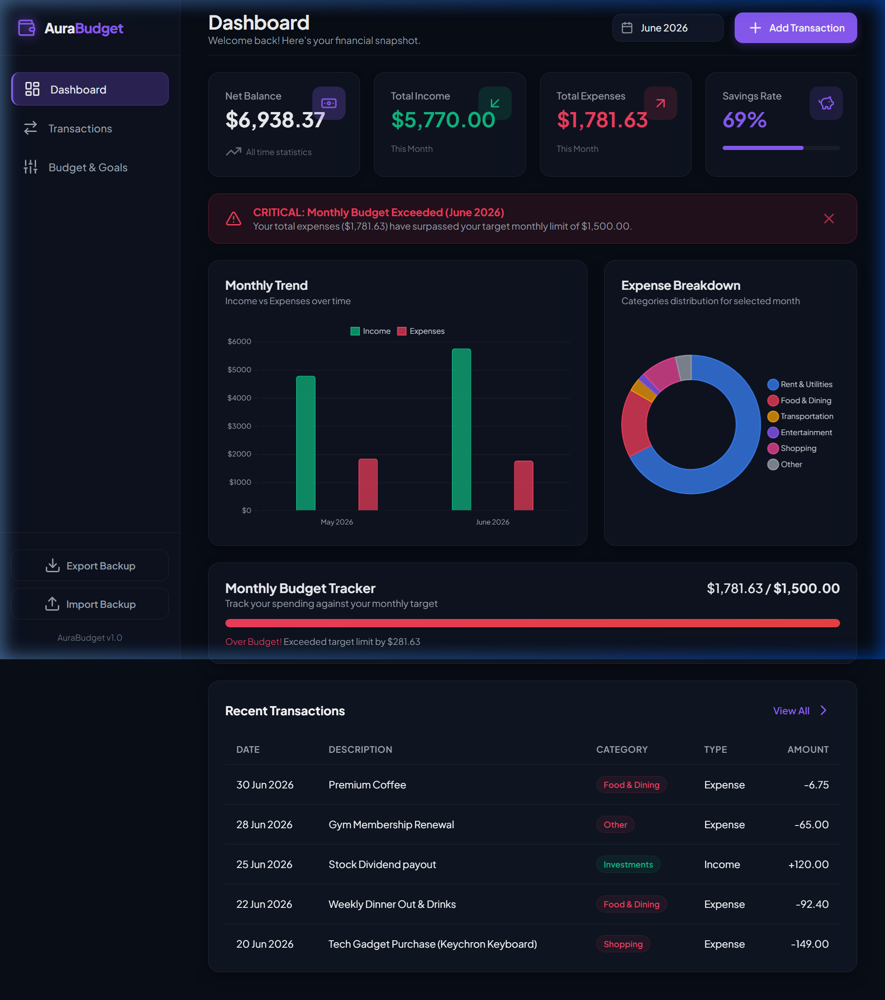
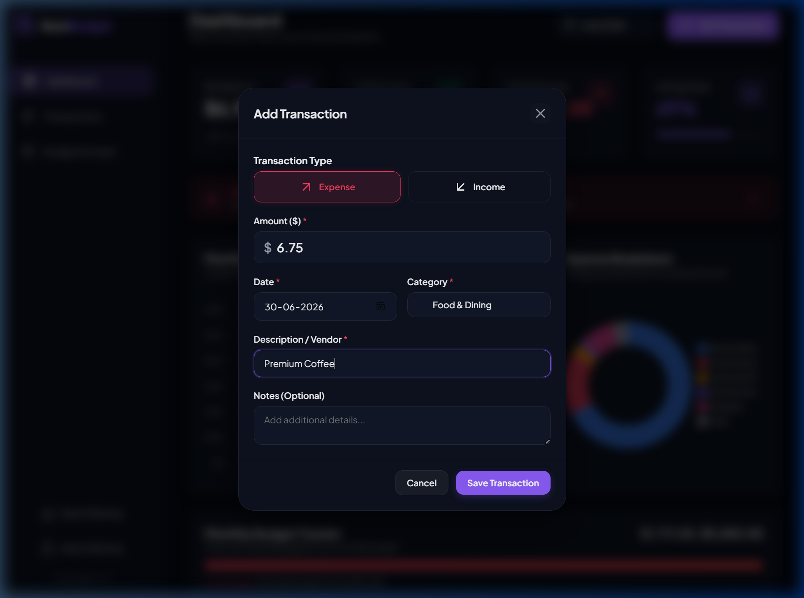

# 💸 AuraBudget - Premium Personal Finance Tracker

AuraBudget is a sleek, premium, and fully responsive **Personal Finance & Budget Tracker** web application designed to help small businesses and individuals track their daily income and expenses in one gorgeous, unified dashboard. It operates completely on the client side, using `localStorage` for automatic, instant data persistence.

---

## ✨ Features

- **📊 High-Impact Analytics:**
  - **Dynamic Metrics Summary:** Get real-time updates on Net Balance, Monthly Income, Monthly Expenses, and your overall Savings Rate (with a progress indicator).
  - **Expense Breakdown Chart:** An interactive, responsive Donut Chart (Chart.js) grouping your monthly expenditures by category.
  - **Income vs Expense Monthly Trend:** A grouped Bar Chart visualizing your historical financial trends over the last 6 months.
- **📝 Complete Transaction Ledger (CRUD):**
  - **Add, Edit, and Delete:** Manage transaction items effortlessly with a modern, modal-based form UI.
  - **Smart Category Assignment:** Automatic categorization options context-dependent on whether the transaction is an Income (Salary, Freelance, etc.) or an Expense (Rent, Food, etc.).
- **⚙️ Monthly Budget Targets & Alert Engine:**
  - Set a custom monthly budget limit.
  - Track spending with a colored visual progress bar (which turns warning yellow, and critical red if exceeded).
  - An animated top banner sounds the alarm when your spending exceeds the configured alert percentage threshold (e.g. 85%).
- **🔍 Advanced Search & Filter System:**
  - Instant text-search on titles, categories, and custom notes.
  - Filters to isolate transactions by Type (Income/Expense), category selection, or Month.
  - Dynamic sorting by Date (newest/oldest) and Amount (highest/lowest).
  - Clean pagination logic to prevent interface clutter.
- **💾 Data Portability:**
  - **Export to CSV:** Back up your transaction history as a standard spreadsheet file at any time.
  - **Import from CSV:** Easily load previous backups back into the app using a built-in parse and merge engine.
  - **Factory Reset:** Erase all stored entries and restore defaults with double-confirmation protection.
- **📱 Premium Responsive Design:**
  - Built with a modern dark-mode aesthetic, utilizing translucent glassmorphism panels, vivid accent glowing elements, and smooth micro-animations.
  - Fully mobile-responsive layout (collapsible sidebar navigation drawers, stacking metrics grids, and scrollable data tables).

---

## 🛠️ Project Structure

```bash
├── screenshots/               # Application UI captures and demo media
├── index.html                 # Main Single-Page App DOM structure
├── style.css                  # UI Design System, CSS variables, & responsiveness
├── app.js                     # State management, local storage sync, charts & CRUD logic
├── package.json               # Node dev tool shortcuts
├── vite.config.js             # Vite development server settings
└── README.md                  # Setup guidelines and documentation
```

---

## 🚀 Setup & Execution Instructions

Follow these simple steps to run AuraBudget on your local machine:

> Note: The GitHub repository page shows the source code only. To use the app in a browser, run it locally with Vite or open the deployed Netlify link.

### 1. Prerequisites
Ensure you have [Node.js](https://nodejs.org/) (version 16 or newer) installed.

### 2. Installation
Open your terminal in the project directory and install the developer dependencies (Vite):
```bash
npm install
```

On Windows PowerShell, if `npm` is blocked by the execution policy, use:
```powershell
npm.cmd install
```

### 3. Run the Development Server
Launch Vite's local dev server:
```bash
npm run dev
```

On Windows PowerShell, use:
```powershell
npm.cmd run dev
```

The application will launch automatically in your default browser at **`http://localhost:3000`**. If it doesn't open automatically, navigate to that URL in your browser.

### 4. Build for Production
To bundle and compile optimized static files into the `dist/` folder:
```bash
npm run build
```

---

## 💡 Technical Approach & Choices

- **Vite (Dev Server):** Used as a zero-config local server tool. This provides hot module replacement (HMR) for styling and scripting updates, along with a production bundler.
- **Vanilla CSS (No Tailwind):** Formed a clean CSS stylesheet using custom properties (variables) to enable uniform themes, flexible layouts using CSS Grid and Flexbox, custom scrolls, and keyframe animations.
- **Chart.js via CDN:** Picked for rendering interactive charts. It handles responsiveness perfectly, features smooth initial hover/scale animations, and is light to load.
- **Lucide Icons via CDN:** Employed for consistent iconography. Rendered programmatically via `lucide.createIcons()` for crisp SVGs.
- **Clean HTML5 Semantic Structure:** Maximized compatibility and structure by styling standard tables, headings (`<h1>`, `<h3>`), sidebars (`<aside>`), and navigation buttons.

---

## 📸 Screenshots & Visual Interface

### 1. Main Dashboard View
A beautiful dashboard layout containing the metrics summary card, dynamic progress budget tracker, and two analytics charts:


### 2. Transaction Insertion Modal Form
A focused, modal form allowing details input for description, category selection, and amount configuration:


### 3. Interactive Success Notification
Clean notifications alert the user of successful addition, edits, imports, or budget warning events.

---
## Live Link : https://endearing-cendol-c6434a.netlify.app/

---


## 📄 License
This project is open-source. Feel free to use, modify, and distribute as desired.
